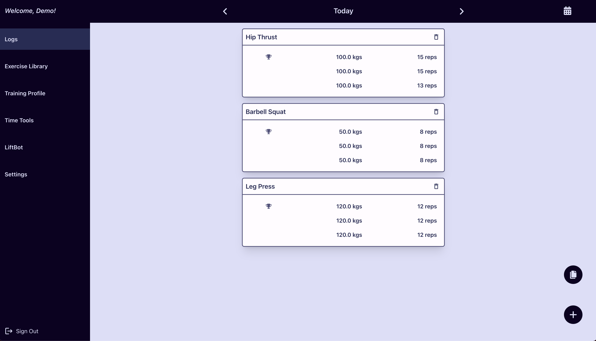
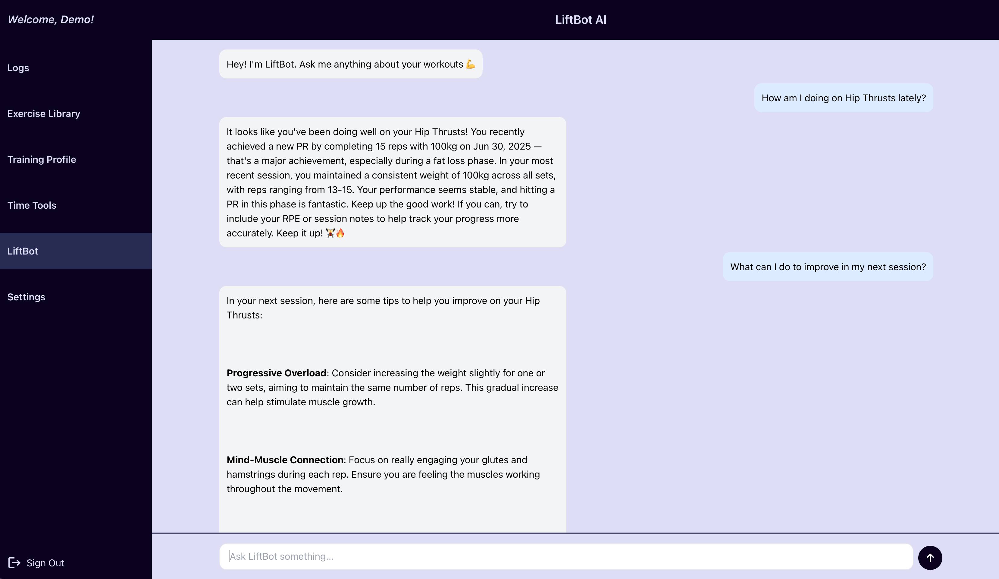

# 🏋️‍♂️ LiftLog

**LiftLog** is a full-stack strength training tracker designed for lifters who want more than just sets and reps. In addition to managing workout logs, personal records, and a customizable exercise library, LiftLog includes an intelligent **LiftBot AI** that analyzes your training history and goals to provide contextual insights and guidance. This project demonstrates my ability to build an advanced PERN (PostgreSQL, Express, React, Node.js) application with meaningful AI integration and data personalization.

---

## 🚀 Live Demo

[🔗 View Live Project](https://lift-log.onrender.com/)

  


---

## 🎯 Project Goals

- Provide a modern, structured interface for logging workouts
- Track personal records (PRs) over time
- Create a dynamic exercise library
- Use AI to generate user-specific and context-sensitive training feedback
- Build a truly personalized strength tracking experience

---

## ✨ Features

- User authentication using Passport.js 
- Track sets, reps, weight, RPE/RIR, and notes per lift
- Auto-detection of **personal records (PRs)**
- Add/remove custom exercises from your library
- Set training goals and calorie goals (e.g. hypertrophy, strength, hybrid, fat loss, recomp, muscle gain)
- **LiftBot AI** responds to questions based on your training logs and goals
- Time tools that include a timer and stopwatch
- Responsive design for mobile and desktop

---

## 🧰 Tech Stack

**Frontend:** React, TypeScript, CSS, Redux  
**Backend:** Node.js, Express  
**Database:** PostgreSQL  
**Authentication:** Passport.js (Local Strategy + Google OAuth)  
**AI Integration:** OpenAI API (LiftBot)

---

## 🛠 Installation & Setup

### Prerequisites
- Node.js
- Git

⚠️ This app connects to a private PostgreSQL database hosted on Render. For security reasons, the database credentials and AI API keys are not public.

If you'd like to run this project locally for learning or collaboration, please contact me directly.

---

### 🔧 Setup Instructions

```bash
# 1. Clone the repository
git clone https://github.com/yourusername/liftlog.git
cd liftlog

# 2. Install backend dependencies
npm install

# 3. Install frontend dependencies
cd views
npm install
```

--- 

## 👤 Author

**Your Name**  
[GitHub](https://github.com/rocklyn-r) • [LinkedIn](https://linkedin.com/in/antica-rocklyn-rusinovic)


## 📄 License

This project is for personal portfolio use and not licensed for commercial deployment.
